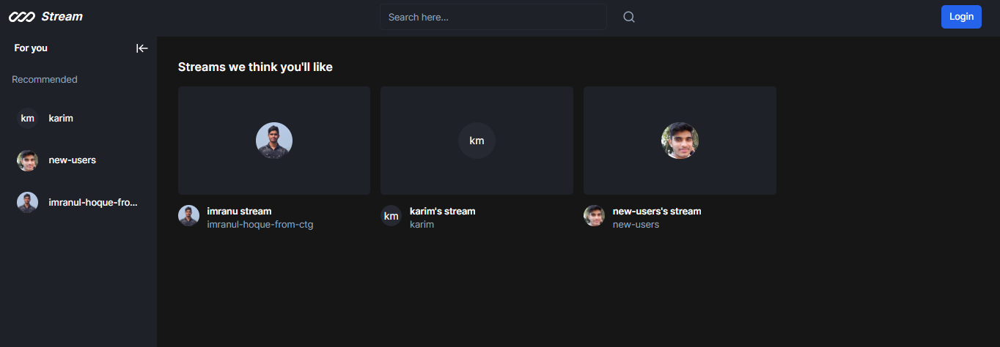

Clone the project

```bash
  git clone https://github.com/Imranul-hoque/advanced_todo_list.git
```

Go to the project directory

```bash
  cd my-project
```

Install dependencies

```bash
  npm install
```

Start the server

```bash
  npm run start
```


## Usage

1. setup database for prisma
2. Run the application: `npm start` (or `yarn start`).
3. Open the app in your web browser: `http://localhost:3000`.


## Folder Structure

**Actions** : This folder is concern for Nextjs 14 new stable feature server actions

**Prisma** : Prisma ORM for make automate database migrations process easy

**App** : That one is main for the app router in next js. This folder is so important for file based routing system

**Components** : All utility functions goes into components folder


## Contact

For questions or support, please contact [Your Name] at [imran.contuct@gmail.com].

# Hi, I'm Imranul Hoque! 👋


## 🛠 Tech
`Html` `Css` `Javascript` `Nextjs` `Tailwindcss` `Typescript` `Nodejs` `Nestjs` and related tech


## SnapStream



# Featured:
## Intuitive Interface: 
Our platform features a clean and intuitive interface, making it easy for both creators and viewers to navigate and enjoy the experience.

## High-Quality Streaming: 
Enjoy high-quality video streaming with adaptive playback, ensuring a consistent and buffer-free experience regardless of your internet connection.

## Interactive Community: 
Engage with the community through comments, likes, and shares. Connect with like-minded individuals and creators who share your interests.

## Secure and Reliable: 
Your security is our priority. Rest assured that your data and content are handled with the utmost care and protection.

## Acknowledgments
Special thanks to the Next.js community for their valuable contributions and support.


